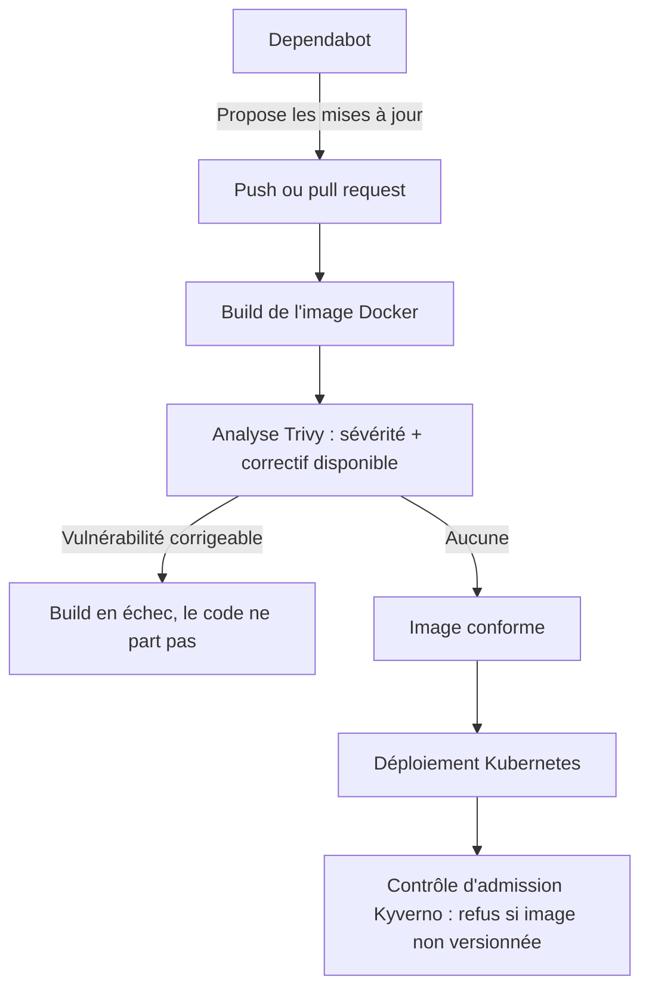

# Chaîne DevSecOps — Triage automatisé des vulnérabilités

Une chaîne d'intégration continue qui analyse une application à chaque commit, ne retient que les vulnérabilités sur lesquelles une action est possible, et refuse de déployer ce qui n'est pas conforme.

**Résultat mesuré sur l'application cible : 1911 alertes brutes → 0 vulnérabilité corrigeable**, sans aucune exception ni mise en sourdine.

---

## Le problème

Brancher un scanner de sécurité sur une application est facile. L'exploiter ne l'est pas.

Une image Docker construite en trois lignes contient ici **191 paquets logiciels**, dont un seul a été choisi explicitement. Ces paquets traînent **1911 vulnérabilités connues et publiées**.

Personne ne lit 1911 lignes. Le rapport est ignoré, le scanner finit par être désactivé, et le jour où une faille grave et corrigeable apparaît, elle part en production noyée dans la masse.

Le problème n'est donc pas de détecter — les scanners font déjà très bien ce travail. Le problème est que le résultat de la détection est inexploitable, et que sa lecture reste facultative.

## La réponse

| Étape du filtre | Alertes restantes |
| --- | --- |
| Vulnérabilités connues dans l'image | **1911** |
| Disposant d'un correctif publié | 42 |
| Après retrait des paquets jamais exécutés | 3 |
| Après mise à jour des paquets système | **0** |

**Réduction du bruit : 97,8 %** entre le brut et l'actionnable.

Aucune de ces réductions n'est une mise en sourdine. Les 1869 alertes écartées n'avaient aucun correctif publié — aucune action n'était possible dessus. Les suivantes concernaient `linux-libc-dev`, un paquet d'en-têtes de compilation tiré par PHP et jamais exécuté : il a été **retiré de l'image**, pas ignoré. La dernière, dans OpenSSL, a été corrigée par une mise à jour.

Et ce zéro est défendu : **le build échoue** si une vulnérabilité corrigeable réapparaît.

## Architecture



## Les garde-fous en place

**Analyse à chaque commit.** Trivy compare les paquets de l'image aux bases de vulnérabilités publiques. Aucune intervention manuelle : une vérification qu'il faut penser à lancer n'est pas faite.

**Blocage du build.** `--exit-code 1` fait échouer la chaîne dès qu'une vulnérabilité corrigeable est détectée. Un rapport dont la lecture est facultative n'est pas lu ; un build rouge ne s'ignore pas.

**Contrôle d'admission.** Une politique Kyverno refuse à l'entrée du cluster toute image dont la version n'est pas explicite. Une image non versionnée peut changer de contenu sans prévenir : impossible alors de garantir que ce qui tourne est ce qui a été analysé.

**Correctifs proposés automatiquement.** Dependabot surveille l'image de base et ouvre une pull request à chaque nouvelle version — déjà construite et scannée par la chaîne avant d'être lue.

## Démarrage

```bash
git clone https://github.com/Tresor300/projet_web.git
cd projet_web
docker compose up --build
```

L'application est ensuite accessible sur `localhost:8080/fonctionnalite_1/accueil.php`. Rien d'autre à installer : ni PHP, ni serveur web, ni base de données.

Pour le déploiement Kubernetes :

```bash
k3d cluster create irve0
docker build -t irve-web:1.0 .
k3d image import irve-web:1.0 -c irve0
kubectl apply -f k8s/
kubectl port-forward deployment/irve-web 8081:80
```

## Application cible

La partie web du projet IRVE (PHP / MySQL / Leaflet), une application existante réutilisée comme cobaye. **Son code n'a pas été modifié** : l'objet de ce dépôt est la chaîne, pas l'application.

Les fonctionnalités 4 et 5 (prédiction) renvoient une erreur 500 dans le conteneur : elles appellent des scripts Python absents de l'image. C'est un choix assumé — l'image ne contient que ce qui est nécessaire au périmètre analysé.

## Avancement

- [x] **1. Conteneurisation** — Dockerfile, build reproductible
- [x] **2. Orchestration locale** — base de données conteneurisée, `docker compose`
- [x] **3. Intégration continue** — build automatique à chaque push
- [x] **4. Analyse** — Trivy branché sur la chaîne, mesure du volume brut
- [x] **5. Triage et blocage** — filtrage, nettoyage de l'image, échec du build
- [x] **6. Correctifs automatiques** — Dependabot
- [x] **7. Déploiement Kubernetes** — cluster k3d local
- [x] **8. Contrôle d'admission** — politique Kyverno
- [ ] **9. Observabilité** — Grafana déployé, collecte des métriques à faire

## Stack

Docker · Docker Compose · GitHub Actions · Trivy · Dependabot · Kubernetes (k3d) · Kyverno · Grafana

## Journal de construction

Chaque étape est documentée dans [`journal.md`](journal.md) : le problème résolu, ce qui casserait sans elle, et les points encore ouverts. Y figurent aussi les erreurs rencontrées en chemin — casse liée à la sensibilité de Linux à la casse des noms de fichiers et de tables, ordre des couches Docker, tolérance de Kyverno aux ressources préexistantes.

## Auteur

Trésor Virenque Fowe Takam — élève ingénieur ISEN Nantes, orientation DevOps / Cloud
[LinkedIn](https://linkedin.com/in/tresorfowe) · [GitHub](https://github.com/Tresor300)
